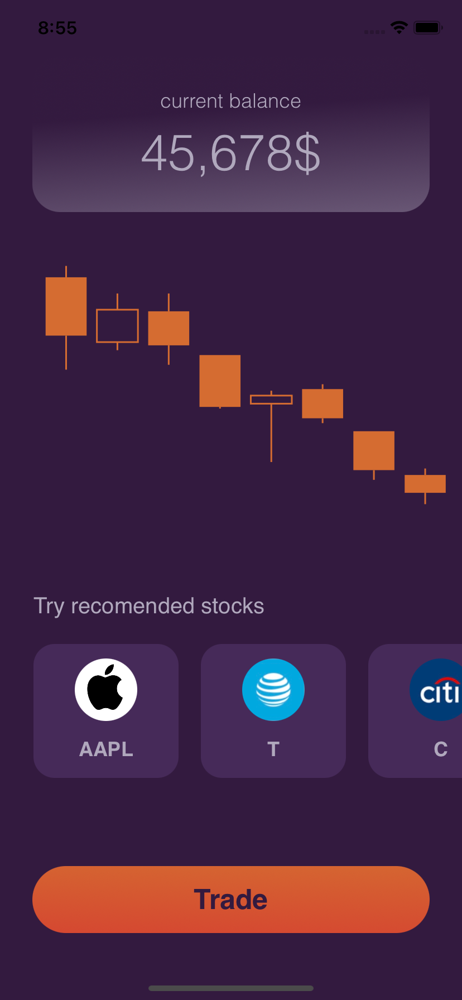

https://github.com/nikitaoltyan/Mech-Trading-Systems/blob/main/README.md

# ODA – Trading Bot
## For Mech Trading Systems study course.

ODA - мобильное приложение, доющие пользвателям доступ к разработанному и обученному для конкретных тикеров торговому боту.
ODA - Oltyan, Dzgoev, Ablyazova – development team.

- Мобильное iOS приложение
- Предобучение для некоторых тикеров
- Более 20% годовой доходности
- ✨Магия ✨

# Содержание

[***Серверная часть***](https://github.com/nikitaoltyan/Mech-Trading-Systems#Серверная-часть)

[***Торговый алгоритм***](https://github.com/nikitaoltyan/Mech-Trading-Systems#Торговый-алгоритм)

[***Приложение***](https://github.com/nikitaoltyan/Mech-Trading-Systems#Приложение)

[***Руководство пользователя***](https://github.com/nikitaoltyan/Mech-Trading-Systems#Руководство-пользователя)

# Серверная часть

# Торговый алгоритм

Торговый алгоритм бота строится на основе двух индикаторов: Полос Боллинджера (Bollinger Bands) и стохастика (Stochastic Ascillator), что способствует быстрому выявлению изменения тренда и своевременному входу в Long или. Short позицию. 

Выход из сделки осуществляется по достижения цены инструмента отметок Stop Loss или Take Profit. Эти значения являются гиперпараметрами. Их оптимальные показатнли определяются системой на основе исторических данных используемого тикера (на промежутке 5 лет. Дневной датафрейм.)

***Вход в позицию и выход из нее осуществляется автоматически без действий пользователя.***

Ежедневно после закрытия биржи сервер получает обновленную информацию о прошедшем торговом дне. Алгоритм применяет полученную информацию, проверяя следующие события на промежутке n свечей (гиперпараметр функции):

- Цена закрытая пересекла нижнюю полосу боллинджера 
- Быстрая линия стохастика пересекла медленную снизу вверх
- У пользователя есть доступные средства на счету

Одновременное исполнение данных условий сигнализирует об изменении тренда вверх, после чего бот приобретает акции на все доступные средства.


***Торговый бот ODA оперирует следующими гиперпараметрами (предобучены):***

- period - период скользящей средней.
- multiplier - множитель в полосах Боллинджера, определяет размах полос.
- n - сколько прошедших свечей рассматривает алгоритм при принятии решения.
- stop_loss - (в %) после достижения какого убытка сделка закрывается в минус.
- take_profit - (в %) после достижения какой прибыли сделка закрывается в плюс.

В работе учитывается комиссия брокера 0.03% – взята с официального сайта Альфа.Инвестиции. Может быть понижена переходом на трейдерские скальпинговые счета.

# Приложение

Приложение ODA разработано на языке ***Swift*** и доступно для установки через Xcode всеми пользователями с iOS 13 и выше.

---

<p align="center">

</p>

---

ODA имеет выверенный темный дизайн с минимумом функционала, чтобы не отвлекать пользователей от работы. Экран приложения разбит на 4 смысловых блока:

- Доступный пользователю баланс - вычисляется из совокупной цены всех приобретенных ботом акций + остатка денежных средств на счете пользователя.
- Интерактивный график цены выбранного торгового инструмента. _(Визуальное обозначение мест входа и выхода из позиции в разработке)._
- Выбор торгового инструмента из предложенного списка.
- Кнопка начала\остановки торговли.

***Важно учитывать, что приложение не содержит в себе функционала торгового робота и лишь отображает пользователю всю нынешнюю информацию по движению средств и состоянию торгов, а также отсылает на сервер сигналы о смене тикера и начале\остановке торгов.***

Данные о тикере, ценах закрытия и открытия приложение ассинхронно получает после выполнения серверного запроса по URL с названием выбранного тикера. Например: "https://oda-tool.herokuapp.com/AAPL"

```sh
func fetchData(completion: @escaping ([String:Any]?, Error?) -> Void) {
    let url = URL(string: "https://oda-tool.herokuapp.com/AAPL")!

    let task = URLSession.shared.dataTask(with: url) { (data, response, error) in
        guard let data = data else { return }
        do {
            if let array = try JSONSerialization.jsonObject(with: data, options: .allowFragments) as? [String:Any]{
                completion(array, nil)
            }
        } catch {
            print(error)
            completion(nil, error)
        }
    }
    task.resume()
}
```

# Руководство пользователя
