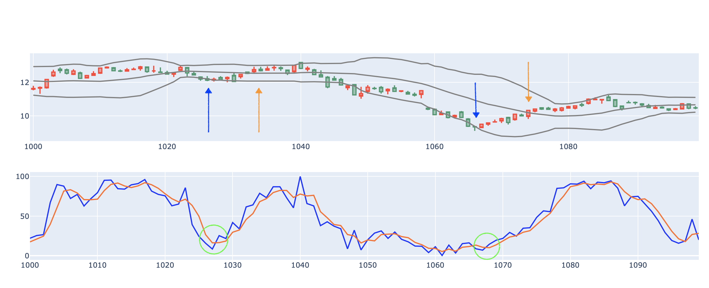
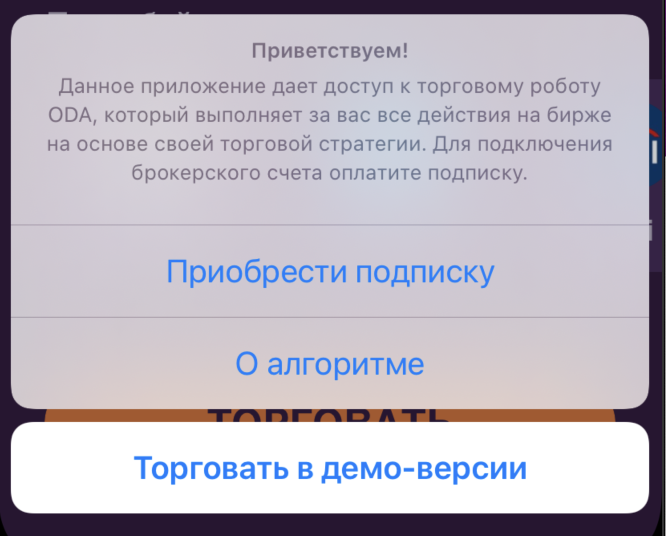
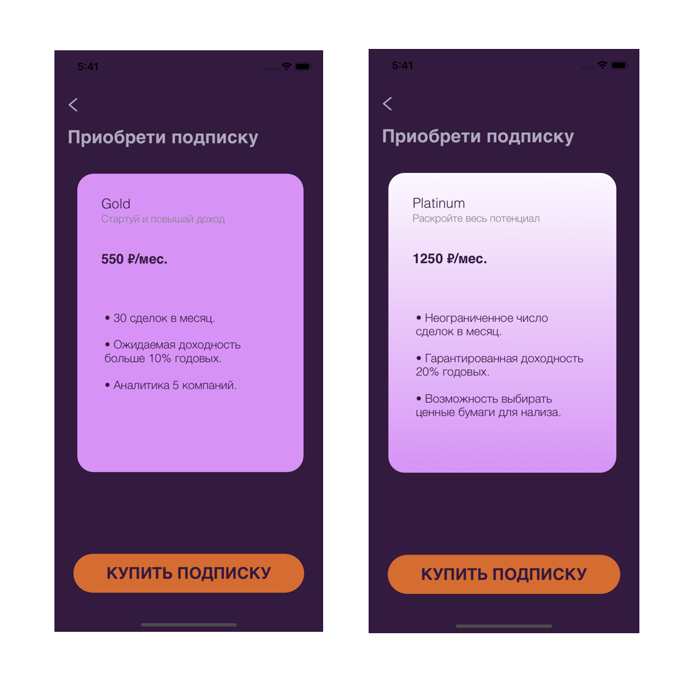

https://github.com/nikitaoltyan/Mech-Trading-Systems/blob/main/README.md

# ODA – Trading Bot
## For Mech Trading Systems study course.

ODA - мобильное приложение, доющие пользвателям доступ к разработанному и обученному для конкретных тикеров торговому боту.
ODA - Oltyan, Dzgoev, Ablyazova – development team.

- Мобильное iOS приложение
- Предобучение для некоторых тикеров
- Более 20% годовой доходности
- ✨Магия ✨

# Содержание

[***Серверная часть***](https://github.com/nikitaoltyan/Mech-Trading-Systems#Серверная-часть)

[***Торговый алгоритм***](https://github.com/nikitaoltyan/Mech-Trading-Systems#Торговый-алгоритм)

[***Приложение***](https://github.com/nikitaoltyan/Mech-Trading-Systems#Приложение)

[***Руководство пользователя***](https://github.com/nikitaoltyan/Mech-Trading-Systems#Руководство-пользователя)

# Серверная часть

Для работы нашего бота необходим компьютер, который 24/7 будет работать и мониторить финансовые рынки.

<p align="center">

</p>

В случае нашего бота, данным компьютером является сервер на сервисе heroku. Мы выбрали heroku, потому что он удобный,
бесплатный и отвечает требуемому нам функционалу.

На нем бот производит все необходимые операции:
1. Получение данных из базы Yahoo
1. Реализация алгоритмов
2. Возможность визуализации

При помощи систему API, разработчики
имеют возможность связать работу сервера с любой точкой доступа, будь то вэб-сайт, десктоп программа или мобильное 
приложение, как в нашем случае.

Пример работы:

1. Операция получения данных происходит GET запросом по следующему url: https://oda-tool.herokuapp.com/{ticker}
2. Операция визуализации происходит GET запросом по следующему url: 
   https://oda-tool.herokuapp.com/{ticker}/dash/{Close|Open|Volume}
    
# Торговый алгоритм

Торговый алгоритм бота строится на основе двух индикаторов: Полос Боллинджера (Bollinger Bands) и стохастика (Stochastic Ascillator), что способствует быстрому выявлению изменения тренда и своевременному входу в Long или. Short позицию. 

Выход из сделки осуществляется по достижения цены инструмента отметок Stop Loss или Take Profit. Эти значения являются гиперпараметрами. Их оптимальные показатнли определяются системой на основе исторических данных используемого тикера (на промежутке 5 лет. Дневной датафрейм.)

***Вход в позицию и выход из нее осуществляется автоматически без действий пользователя.***

Ежедневно после закрытия биржи сервер получает обновленную информацию о прошедшем торговом дне. Алгоритм применяет полученную информацию, проверяя следующие события на промежутке n свечей (гиперпараметр функции):

- Цена закрытая пересекла нижнюю полосу боллинджера 
- Быстрая линия стохастика пересекла медленную снизу вверх
- У пользователя есть доступные средства на счету

Одновременное исполнение данных условий сигнализирует об изменении тренда вверх, после чего бот приобретает акции на все доступные средства.

<p align="center">

</p>


***Торговый бот ODA оперирует следующими гиперпараметрами (предобучены):***

- period - период скользящей средней.
- multiplier - множитель в полосах Боллинджера, определяет размах полос.
- n - сколько прошедших свечей рассматривает алгоритм при принятии решения.
- stop_loss - (в %) после достижения какого убытка сделка закрывается в минус.
- take_profit - (в %) после достижения какой прибыли сделка закрывается в плюс.

В работе учитывается комиссия брокера 0.03% – взята с официального сайта Альфа.Инвестиции. Может быть понижена переходом на трейдерские скальпинговые счета.

# Приложение

Приложение ODA разработано на языке ***Swift*** и доступно для установки через Xcode всеми пользователями с iOS 13 и выше.

---

<p align="center">

</p>

---

ODA имеет выверенный темный дизайн с минимумом функционала, чтобы не отвлекать пользователей от работы. Экран приложения разбит на 4 смысловых блока:

- Доступный пользователю баланс - вычисляется из совокупной цены всех приобретенных ботом акций + остатка денежных средств на счете пользователя.
- Интерактивный график цены выбранного торгового инструмента. _(Визуальное обозначение мест входа и выхода из позиции в разработке)._
- Выбор торгового инструмента из предложенного списка.
- Кнопка начала\остановки торговли.

Данные элементы представлены:

---

<p align="center">

</p>

---

***Важно учитывать, что приложение не содержит в себе функционала торгового робота и лишь отображает пользователю всю нынешнюю информацию по движению средств и состоянию торгов, а также отсылает на сервер сигналы о смене тикера и начале\остановке торгов.***

Данные о тикере, ценах закрытия и открытия приложение ассинхронно получает после выполнения серверного запроса по URL с названием выбранного тикера. Например: "https://oda-tool.herokuapp.com/AAPL"

```sh
func fetchData(completion: @escaping ([String:Any]?, Error?) -> Void) {
    let url = URL(string: "https://oda-tool.herokuapp.com/AAPL")!

    let task = URLSession.shared.dataTask(with: url) { (data, response, error) in
        guard let data = data else { return }
        do {
            if let array = try JSONSerialization.jsonObject(with: data, options: .allowFragments) as? [String:Any]{
                completion(array, nil)
            }
        } catch {
            print(error)
            completion(nil, error)
        }
    }
    task.resume()
}
```

# Руководство пользователя

Использовать торгового робота ODA как никогда легко. Все функции уже были реализованы на серверной стороне приложения, а гиперпараметры подоброны специально для тех акций, которые давали максимальную доходность на прошедшем промежутке в 5 лет.

Пользователю необходимо лишь скачать приложение, как это было описано в начале соотствествующего [*блока*](https://github.com/nikitaoltyan/Mech-Trading-Systems#Приложение), после чего войти в учетную запись своего брокера _(в разработке)_ и предоставить приложению доступ к своему счету.

После этого необходимо лишь выбрать наиболее интересный пользователю тикер из предложенных:

<p align="center">

</p>


И начать торговлю нажатием ооствествующей кнопки:

<p align="center">

</p>

***Важно обратить внимание, что для использования бота необходимо войти в учетную запись брокера для подключения к счетам. Иначе торговля будет происходить в демо-режиме не настоящими средствами.***

Также возможно перейти во вкладку покупки подписки бота, а также ознакомиться с работой алгоритма бота.

<p align="center">

</p>

Для подключения к брокеру необходимо оформить подписку. Важно учитывать, что есть несколько тарифов, которые дают разлчиные описанные возможности:

<p align="center">

</p>

После приобретения подписки приложение вернется на главный экран и торговля реальными средствами будет доступна.


После достижения желаемого баланса пользователь может остановить торговлю нажатием на представленную выше кнопку и использовать полученные средства через своего брокера.

***Важно учитывать, что приложение не содержит в себе функционала торгового робота и лишь отображает пользователю всю нынешнюю информацию по движению средств и состоянию торгов, а также отсылает на сервер сигналы о смене тикера и начале\остановке торгов. Поэтому пользователь может безпрепятсвенно переводить приложение в бэкграунд или выключать его – на процесс работы робота это не повлияет.***

---

***Удачной торговли!***
